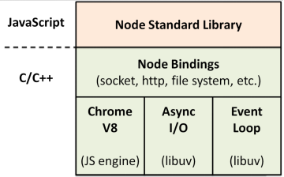

# Node.js



## 优缺点

> Node.js 是一个基于 Chrome V8 引擎的 JavaScript 运行环境

- 优点
    - 异步非阻塞的I/O（I/O线程池）
    - 特别适用于I/O密集型应用
    - 事件循环机制
    - 单线程（成也单线程，败也单线程）
    - 跨平台
- 缺点
    - 回调函数嵌套太多、太深（俗称回调地狱）
    - 单线程，处理不好CPU 密集型任务
- 应用场景
    - Web服务API，比如RESTful API（本身没有太多的逻辑，只需要请求API，组织数据进行返回即可）
    - 服务器渲染页面，提升速度
    - 后端的Web服务，例如跨域、服务器端的请求

## Node中函数的特点

- Node中任何一个模块（js文件）都被一个外层函数所包裹

    - ```js
        function (exports, require, module, __filename, __dirname) {}
        exports：用于支持CommonJs模块化规范的暴露语法
        require：用于支持CommonJs模块化规范的引入语法
        module：用于支持CommonJs模块化规范的暴露语法
        __filename：当前运行文件的绝对路径
        __dirname：当前运行文件所在文件夹的绝对路径
        ```

- 为什么要设计这个外层函数（这个外层函数有什么作用？）
        1).用于支持模块化语法
        2).隐藏服务器内部实现(从作用域角度去看)

## Node中的Global

- 浏览器端。js由那几部分组成
    1. BOM ----> window 浏览器对象模型 -------- 很多的API（location，history）
    2. DOM ----> document 文档对象模型 ---------- 很多的API（对DOM的增删改查）
    3. ES规范 -------------------- ES5、ES6.....
- Node端，js由哪几部分组成
    1. 没有了BOM ----->  因为服务器不需要（服务端没有浏览器对象）
    2. 没有了DOM ----->  因为没有浏览器窗口
    3. 几乎包含了所有的ES规范
    4. 没有了window，但是取而代之的是一个叫做global的全局变量。

### global

- 在Node中禁止函数的this指向global，而是指向了一个空对象。


## 事件循环模型

### setTimeout/setInterval/setImmediate

- setTimeout延迟定时器，即使定时时间是0，也要在主线程全部执行完成后，再来勾回定时器。

- setImmediate是立即执行函数，效果类似于setTimeout为0，也是要在回调队列里边排队的。但它并不是定时器

- ```js
    //延迟定时器
    setTimeout(()=>{
      console.log('setTimeout所指定的回调函数执行了')
    })
    
    //立即执行函数（回调）
    setImmediate(()=>{
       console.log('我是setImmediate指定的回调') 
    })
    
    //立即执行函数（回调）
    process.nextTick(()=>{
       console.log('process.nextTick所指定的回调执行了')
    })
    
    console.log('我是主线程上的代码')
    
    //输出，这里还是有很多问题的！！！！！！！！！！！！！！
    我是主线程上的代码
    process.nextTick所指定的回调执行了
    setTimeout所指定的回调函数执行了
    我是setImmediate指定的回调
    
    ```

- node中事件循环模型共六个阶段。<span style="color:red;font-weight:bold">！！！说的很迷，后边再学！！！</span>

    1. 第一阶段：timers（定时器阶段——setTimeout setInterval,不包括setImmediate,它不是定时器）

        - 开始计时
        - 执行定时器的回调（可能第n轮的时候定时器到点了才执行，定时器的回调只能在这里执行）

    2. 第二阶段：pending callbacks（系统阶段）

        - 执行系统内部的回调，并不是执行我们自己写的回调

    3. 第三阶段：idle,prepare（准备阶段）

        - 

    4. 第四阶段：poll（轮循阶段，核心）

        - 如果回调队列里有待执行的回调函数
            - 从回调队列中取出回调函数，同步执行(一个一个执行)，直到回调队列为空了，或者达到系统最大限度。
        - 如果回调队列为空
            - 如果有设置过setImmediate
                - 进入下一个check阶段，目的：为了执行setImmediate所设置的回调。
            - 如果未设置过setImmediate
                - 在此阶段停留，等待回调函数被插入回调队列。若定时器到点了，进入下一个check阶段，原因：为了走第五阶段，随后走第六阶段，随后第一阶段(最终目的)

    5. 第五阶段：check（专门用于执行setImmediate所设置的回调）

    6. 第六阶段：close callbacks（关闭回调阶段）

    7. ```
        process.nextTick() ---- 用于设置立即执行函数，优先级高于以上所有回调，会插队。
        ```

    8. <span style="color:red;font-weight:bold">这个说法里很多问题：</span>

        1. 这个事件循环模型何时开始轮循？主线程上都执行完吗？
        2. 非定时器和immediate的回调也会进这个循环里吗？
        3. 是各种回调管理模块管理着自己的回调，当回调要执行时放到这个回调队列里来吗？


​	既然目前大多数内核都是多线程的，它们可在后台处理多种操作。当其中的一个操作完成的时候，内核通知 Node.js 将**适合的回调函数添加到 *轮询* 队列**中等待时机执行。

​	当 Node.js 启动后，它会初始化事件循环，处理已提供的输入脚本（或丢入 REPL，本文不涉及到），它可能会调用一些异步的 API、调度定时器，或者调用 process.nextTick()，然后开始处理事件循环。

​	每个阶段都有一个 FIFO 队列来执行回调。当事件循环进入给定的阶段时，它将执行特定于该阶段的任何操作，然后执行该阶段队列中的回调，直到队列用尽或最大回调数已执行。当该队列已用尽或达到回调限制，事件循环将移动到下一阶段，等等。。。。。。。。。。。。。。

