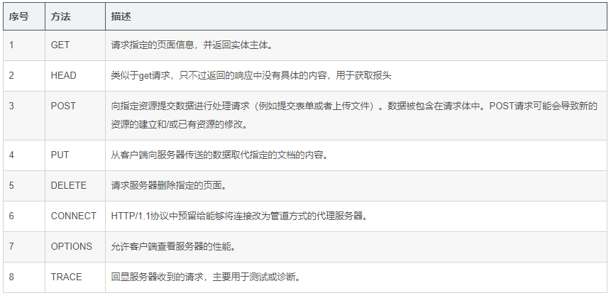
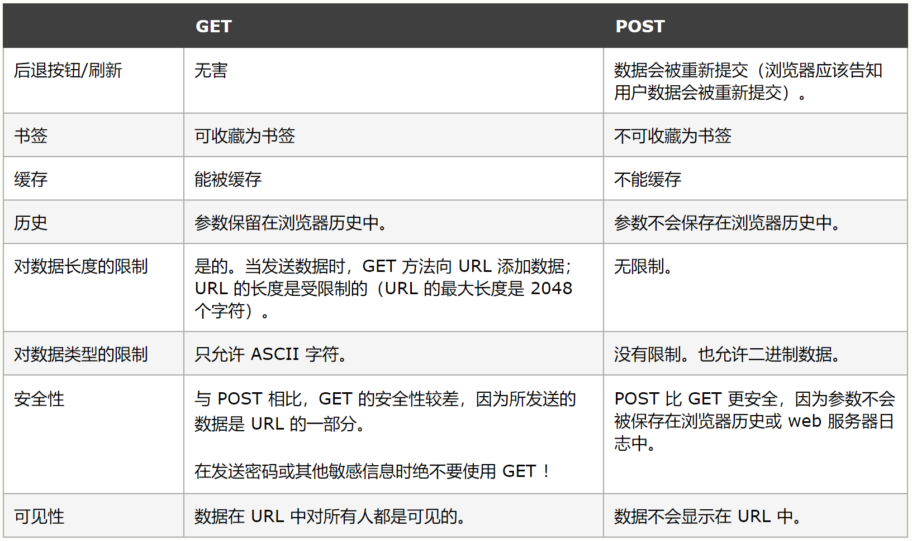

## GET请求与POST请求

### 前言

> HTTP设定了八种发送请求方式（也称为八大“动作”）。这八种方法没有任何本质上的区别。只是让请求，更加有语义化而已。
> 八种方法分别为：OPTIONS、HEAD、GET、POST、PUT、DELETE、TRACE、CONNECT
> 这八种方法最终经过“岁月沉淀”后，最常用的是这两种：GET、POST

### GET

    1. 含义：从指定的资源获取数据（一种“索取”的感觉）。
    2. 什么时候使用GET请求较为合适？
        (1)单纯获取数据的时。
        (2)请求非敏感数据时。

- 能发出get请求的不详尽总结：
    - form（可get 可post）
    - ajax（可get 可post）
    - 浏览器地址栏(只能get)
    - img link scris等html中能访问外部资源的标签(只能get)

### POST

    1.含义：向指定的资源提交要被处理的数据（一种“交差”的感觉）。
    2.什么时候使用POST请求较为合适？
        (1)传送相对敏感数据时。
        (2)请求的结果有持续性的副作用，例如：传递的数据要写入数据库时。
        备注：使用了POST不代表绝对的安全。

### 常见的GET请求：

    1.浏览器地址栏输入网址时（即浏览器请求页面时，且无法手动更改）。
    2.可以请求外部资源的html标签，例如： <a> <link> <script>，且无法手动更改。
    3.发送Ajax时若没有指定发送请求的方式，则使用GET方式，或者明确指出了使用GET请求。
    4.form表单提交时，若没有指明方式，默认使用GET。

### 常见的POST请求：

    1.发送Ajax时,明确指出了使用POST方式时。
    2.form表单提交时明确指出使用POST方式

### 二者的区别

    

## Express

> Express 是一个基于 Node.js 平台的极简、灵活的 web 应用开发框架，它提供一系列强大的特性，帮助你快速创建各种 Web 和移动设备应用。
>
> 简单来说Express就是运行在node中的用来搭建服务器的模块。需要手动安装，不是node内置的。

## express中操作cookie和session教程

### 一、操作cookie：

    1. 设置cookie(给客户端“种”cookie)：
        直接使用res.cookie('','',{})即可。
        
    2. 获取cookie(要第三方中间件):
           * 安装：npm i cookie-parser
           * 引入：const cookieParser = require('cookie-parser')
           * 使用：app.use(cookieParser())
    
    3. 返回给客户端一个cookie：
           * res.cookie('username','peiqi',{maxAge:1000*60*60})
           
           备注：1.cookie是以：key-value的形式存在的，前两个参数分别为：key、value。
                2.maxAge用于配置cookie有效期(单位毫秒)。
                3.如果不传入maxAge配置对象，则为会话cookie，随着浏览器的关闭cookie自动会消失。
                4.如果传入maxAge，且maxAge不为0，则cookie为持久化cookie，即使用户关闭浏览器，
                  cookie也不会消失，直到过了它的有效期。
    
    4. 接收客户端传递过来的cookie：
            * req.cookies.xxx ：获取cookie上xxx属性对应的值。
            备注：cookie-parser中间件会自动把客户端发送过来的cookie解析到request对象上。

### 二、操作session（cookie配合session）：

​    1.下载安装：npm i express-session --save  用于在express中操作session
​    2.下载安装：npm i connect-mongo --save 用于将session写入数据库（session持久化）
​    3.引入express-session模块：
​        const session = require('express-session');
​    4.引入connect-mongo模块：
​        const MongoStore = require('connect-mongo')(session);
​    5.编写全局配置对象：
​        app.use(session({
​          name: 'userid',   //设置cookie的name，默认值是：connect.sid
​          secret: 'atguigu', //参与加密的字符串（又称签名）
​          saveUninitialized: false, //是否在存储内容之前创建会话
​          resave: true ,//是否在每次请求时，强制重新保存session，即使他们没有变化
​          store: new MongoStore({
​            url: 'mongodb://localhost:27017/sessions_container',
​            touchAfter: 24 * 3600 //修改频率（例：//在24小时之内只更新一次）
​          }),
​          cookie: {
​            httpOnly: true, // 开启后前端无法通过 JS 操作cookie
​            maxAge: 1000*30 // 设置cookie的过期时间
​          },
​        }));
​    6.向session中添加一个xxxx，值为yyy：req.session.xxxx = yyy
​    7.获取session上的xxx属性：const {xxx} = req.session

    整个过程是：
        1.客户端第一次发起请求，服务器开启一个session专门用于存储这次请求的一些信息。
        2.根据配置对象的信息，服务器决定是否进行：session持久化等其他操作。
        2.与此同时服务器创建了一个cookie，它的key我们可以自己指定，但是它的value一定是上一步session的唯一标识。
        3.服务器将我们指定好的内容添加进session对象，例如：req.session.xxxx = yyy。
        4.等请求再次过来时，客户端的请求中包含着之前“种”的cookie。
        5.服务器检查携带过来的cookie是否有效，决定是否去读取对应session中的信息。

​    
​    